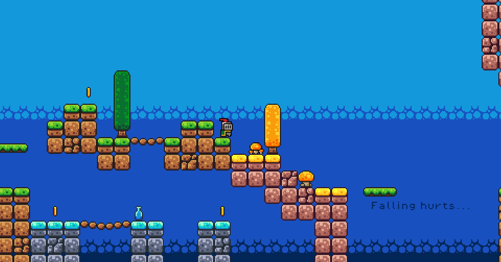

# Godot 2D Platformer Learning
Based on Brackeys Tutorial / Baseado no Tutorial do Brackeys

## Screenshot

---

# English Version

## Project Description

This project was developed by following the tutorial:

How to Make a Video Game – Godot Beginner Tutorial  
https://youtu.be/LOhfqjmasi0

The purpose of this project is to practice 2D game development using the Godot Engine and understand concepts such as:

- Scenes and nodes
- Player movement
- Sprites and animations
- Physics and collisions
- GDScript scripting

## Technologies Used

- Godot Engine: version 4.6
- GDScript

## Features Implemented

- Basic player movement
- Input handling
- Animation system
- Collision detection
- Collectible and score system
- Enemies and death logic
- Basic HUD

## How to Run

1. Install Godot Engine (version 4.6 recommended)
2. Clone this repository

git clone <repository-url>

3. Open the project in Godot
4. Press Play

## Project Structure

/assets        - sprites, sounds, images  
/scripts       - GDScript files  
/scenes        - .tscn scenes  

## License

This project is for educational purposes only.  
Assets belong to their original creators.

---

# Versão em Português

## Descrição do Projeto

Este projeto foi desenvolvido seguindo o tutorial:

How to Make a Video Game – Godot Beginner Tutorial  
https://youtu.be/LOhfqjmasi0

O objetivo é praticar desenvolvimento de jogos 2D usando a Godot Engine e compreender conceitos como:

- Cenas e nós
- Movimentação do jogador
- Sprites e animações
- Física e colisões
- Programação em GDScript

## Tecnologias Utilizadas

- Godot Engine: versão 4.6
- GDScript

## Funcionalidades Implementadas

- Movimentação básica do jogador
- Sistema de entrada
- Sistema de animações
- Detecção de colisões
- Coletáveis e sistema de pontuação
- Inimigos e lógica de morte
- HUD simples

## Como Executar

1. Instale a Godot Engine (versão 4.6 recomendada)
2. Clone este repositório

git clone <url-do-repositorio>

3. Abra o projeto no Godot
4. Clique em Play

## Estrutura do Projeto

/assets        - sprites, sons, imagens  
/scripts       - arquivos GDScript  
/scenes        - cenas .tscn  

## Licença

Projeto para fins educacionais.  
Assets pertencem aos seus respectivos autores.
